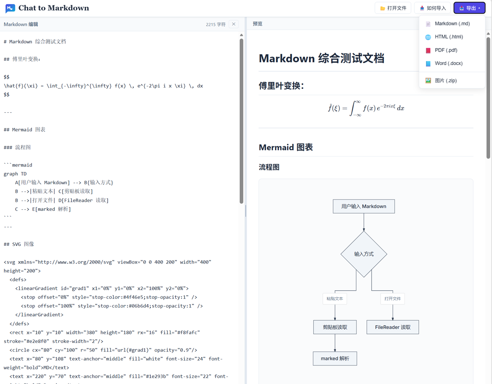

# Chat to Markdown

> 把大模型对话里的 Markdown 变成排版精美的文档：实时预览、一键导出。

<p align="center">
  <a href="http://chat2md.site">🌐 在线体验</a> &nbsp;·&nbsp;
  <a href="https://github.com/agi-hub/chat2md">⭐ GitHub 仓库</a> &nbsp;·&nbsp;
  <a href="http://chat2md.site">http://chat2md.site</a>
</p>

一个纯前端为主、可打包为桌面应用的 Markdown 预览及转换工具。专为「与大模型聊天后导出文档」的场景设计——把 AI 输出的 Markdown（含 Mermaid 流程图、SVG 示意图、数学公式）渲染成所见即所得的预览，并导出为 PDF / Word / HTML 等格式。



---

## 核心功能

### 📝 强大的 Markdown 渲染

- **完整 Markdown 语法**：基于 [marked](https://marked.js.org/) 解析，支持 GFM 扩展语法（表格、任务列表、删除线等）。
- **数学公式**：基于 [KaTeX](https://katex.org/)，同时支持行内公式（`$...$`、`\(...\)`）与块级公式（`$$...$$`、`\[...\]`），自动兼容大模型输出的双反斜杠转义。
- **Mermaid 图表**：流程图、时序图、状态图、类图、ER 图等优先使用 [beautemermaid](https://www.npmjs.com/package/beautiful-mermaid) 渲染（更美观、白底深色主题），饼图、甘特图等其它类型回退到原生 [Mermaid](https://mermaid.js.org/)。
- **代码高亮**：基于 [highlight.js](https://highlightjs.org/)，自动识别多种编程语言。
- **网络图片与内联 SVG**：直接渲染 `` 外链图片和 `<svg>...</svg>` 源码图。

> 💡 **配合大模型使用**：让 AI 用 `Mermaid` 输出流程图、用 `SVG 源码` 绘制示意图，粘贴进编辑器即可获得精美渲染。

### 📥 灵活的导入方式

- **打开文件**：支持 `.md` / `.markdown` / `.txt` 文件。
- **粘贴导入**：一键复制 DeepSeek、豆包等聊天工具里的回复，直接粘贴到编辑器。

### 📤 一键多格式导出

| 格式 | 说明 | 技术实现 |
|:---:|---|---|
| **Markdown** (`.md`) | 导出源文件 | 原生字符串 |
| **HTML** (`.html`) | 导出含渲染结果的网页（含已渲染的 Mermaid SVG） | DOM 序列化 |
| **PDF** (`.pdf`) | 高保真截图分页导出 | jsPDF + html2canvas |
| **Word** (`.docx`) | 应用参考模板样式，Mermaid / SVG / 网络图片自动转换为图片嵌入 | pandoc + reference-doc |
| **图片** (`.zip`) | 批量打包预览中的 Mermaid 图、内联 SVG、网络图片 | JSZip |

**Word 导出的双模式**：
- **桌面端（Tauri）**：通过 Rust 后端（`src-tauri/src/main.rs`）调用本地 `pandoc` 生成 `.docx`。
- **浏览器端**：通过 `server.js` 的 HTTP API（`/api/export-word`）调用 `pandoc`，`sharp` 负责把 SVG 图片转为 PNG。

### 🖥️ 双形态运行

- **Web 模式**：纯前端 + 可选 Node 导出服务。
- **桌面模式**：基于 [Tauri](https://tauri.app/) 打包为跨平台桌面应用（Windows / macOS / Linux），Word 导出走本地 Rust 后端。

### 🎛️ 贴心的交互

- **左右分栏**：编辑器与预览并排，可拖拽分隔条调整宽度（20%~80%）。
- **一键隐藏编辑器**：收起后预览区占满全宽，「显示编辑器」按钮收纳到工具栏，不留空白。
- **实时渲染**：输入即时同步预览。

---

## 技术栈

| 领域 | 技术 |
|---|---|
| 前端框架 | React 18 + Vite 5 |
| Markdown 解析 | marked |
| 数学公式 | KaTeX |
| 图表 | beautemermaid + Mermaid |
| 代码高亮 | highlight.js |
| PDF 导出 | jsPDF + html2canvas |
| Word 导出 | pandoc + docx / Rust |
| 图片打包 | JSZip + file-saver |
| 桌面端 | Tauri 2（Rust 后端） |
| 后端服务 | Express 5 + sharp |

---

## 快速开始

### 环境要求

- Node.js ≥ 18
- 导出 Word 需系统安装 [pandoc](https://pandoc.org/installing.html)

### 安装依赖

```bash
npm install
```

### Web 模式开发

```bash
npm run dev        # 启动前端开发服务器（纯预览，导出走纯前端）
```

如需使用浏览器端 Word 导出（HTTP API 模式），额外启动后端服务：

```bash
npm run server     # 启动 Express 服务（含 Word 导出 API + 静态前端）
# 或一行命令同时拉起服务并打开浏览器
npm start
```

### 构建生产包

```bash
npm run build      # 输出到 dist/
npm run preview    # 本地预览构建产物
```

### 桌面端（Tauri）

```bash
npm run tauri:dev    # 桌面端开发模式
npm run tauri:build  # 打包为各平台安装包
```

---

## 项目结构

```
.
├── src/                    # 前端源码
│   ├── App.jsx             # 主组件（工具栏、分栏、导出菜单、粘贴弹窗）
│   ├── utils/
│   │   ├── markdownRenderer.js  # Markdown 渲染（marked + KaTeX + Mermaid + 代码高亮）
│   │   ├── exportUtils.js       # PDF / Word / HTML / Markdown 导出
│   │   └── codeFormatter.js     # 代码格式化（Prettier）
│   └── ...
├── server.js               # 浏览器端 Word 导出服务（Express + pandoc + sharp）
├── bin/chat2doc.js         # CLI 启动器（启动服务并打开浏览器）
├── src-tauri/              # Tauri 桌面端
│   ├── src/main.rs         # Rust 后端（pandoc Word 导出命令）
│   ├── tauri.conf.json
│   └── icons/              # 应用图标（各尺寸）
├── word_reference.docx     # Word 导出的样式参考模板
└── index.html
```

---

## License

[MIT](LICENSE)
